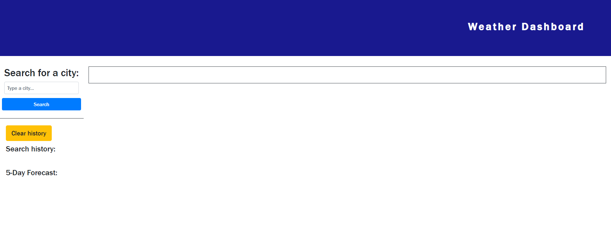
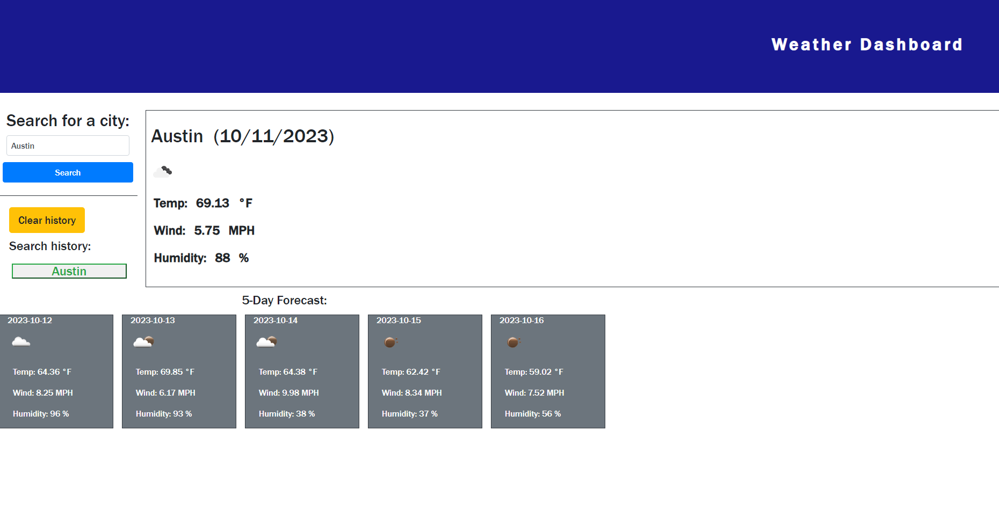
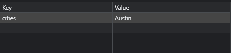
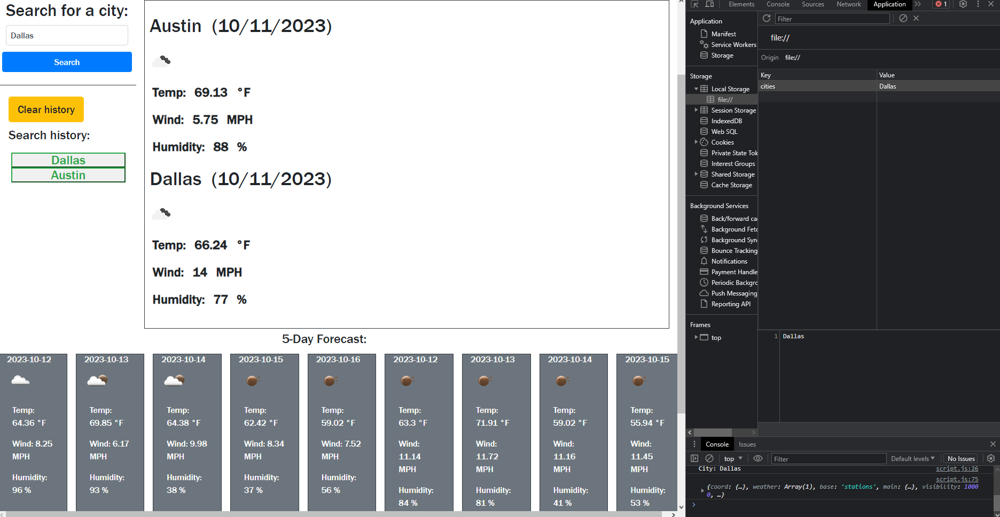
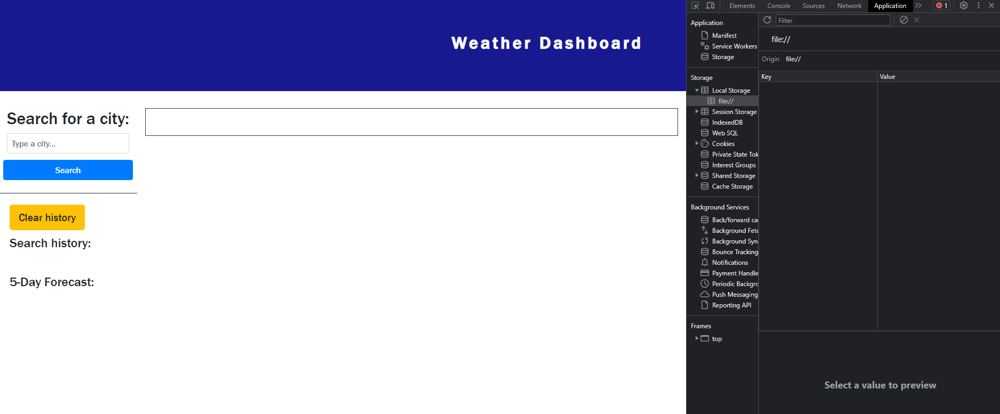

# Weather_And_5-Day_Forecast-App

## Description
Challenge 6 coursework for UT bootcamp.  
This challenge is about creating a webpage that connects to the  
https://openweathermap.org/api when the name of a city is input into the search query.  
It gives the current weather in the city searched, as well as the temperature, wind, and humidity.  
It also gives a 5-day forecast of upcoming weather in the city, using the  
same API, with the same attributes.  

## Screenshots
---Main page---  
  

---Searching a city---  
  

---Seeing in local storage, the city info stored---  
  

---Unfortunately, appends more cities for current weather + 5-day forecast when another search is done---  
  

---Clearing history will clear out local storage + page info---  
  

## Usage
Simply click on the link and watch the magic happen.  
Link to the website: https://alliestewart.github.io/Weather_And_5-Day_Forecast-App/

## What I Have Learned
I have learned a lot about local storage and how to utilize it to append a search history, as well  
as how APIs work in allowing the webpage to access data it otherwise would never be able to retrieve.  

## Credits
Made by Allie Stewart.  
Helpful information provided by https://learn.jquery.com/.

## Licenses
Please refer to the LICENSE in the repository.
